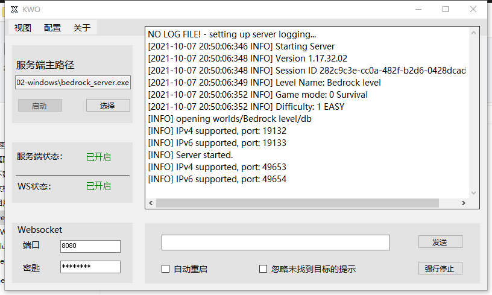

# 
KWO

一款基于webscoket的远程服务器启动器

***

## ℹ️ 主要功能

KWO是一款轻量化的bedrock_server启动器，通过更改控制台编码也可以兼容其他程序集

内置了websocket功能，可以通过websocket通信进行执行命令，开关程序等操作

对于控制台输出流，也可以通过正则表达式来匹配，并通过websocket进行广播

***

## 🔒 安全

考虑到服务器的安全问题，KWO默认发送加密过的数据包

***

## 💬 websocket操作

您需要实现一个websocket客户端，并连接到KWO

当KWO控制台有提示连接时，您的连接是有效的

然后您就可以发送标准数据包了

