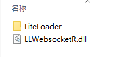

# <center>LLWebSocketAPI</center>

<center>通过Websocket协议与BDS服务器联动 ;)</center>

***

1.下载LLWS

可以在[minebbs](https://www.minebbs.com/resources/c-bdx-liteloader-bdswebsocketapi.2150/)或者[XBX官方QQ群](https://jq.qq.com/?_wv=1027&k=rmCKLG7M)中下载文件

下载后解压，如图所示



2.装载

把这两个都拖进bds的plugins文件夹中

然后进入`plugins/liteloader/websocket/config.json`中修改端口和密匙

``` jsonc
{
	"wsaddr":"0.0.0.0:8123",  //websocket服务器地址
	"endpoint":"/mc",   //websocket服务器endport
	"encrypt":"aes_cbc_pck7padding",   //加密模式
	"wspasswd":"passwd",  //websocket密匙
	"enableLog": false   //是否显示调试信息
}
```

一切修改完毕后开启bds，当看到

`BDSWebsocket Loaded! Acthor: WangYneos & YQ.`

的字样时，说明插件装载成功