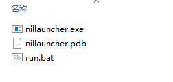

# 
Nillauncher

概述

***

## 安装

您可以从[minebbs](https://www.minebbs.com/resources/nillauncher-ui-bds.2994/)或者[Release](https://github.com/XBridgeX/nillauncher/releases)下载

解压后如图所示

把这些文件放到bedrock_server.exe同级目录即可