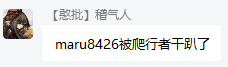

# XBridgeN：一般配置
当检测到配置文件不存在时，XBridgeN会自动生成配置文件。以下配置文件均支持热修改（修改完成后无需重启程序即可生效）

## 生物实体数据
`./config/mobs.json` - 用于保存实体（玩家、生物）命名。
当玩家/生物被杀时，会通过该文件的内容将死亡事件转发到群内

示例配置：
```json
{
	"Arrow": "箭",
	"Bat": "蝙蝠",
	"Creeper": "爬行者",
	"Blaze": "烈焰人"
}
```
实现的效果：



## 玩家事件配置


`./config/players_event.json` - 配置玩家事件发生时群内发送消息的内容。

示例配置：
```json
{
	"player_not_admin": "您不是管理员，无权执行该操作！",	//非XBridgeN管理员时
	"player_join": "玩家 {0} 加入了服务器",		//玩家加入服务器时
	"player_left": "玩家 {0} 离开了服务器",		//玩家退出服务器时
	"player_die": {		//玩家死亡事件
		"cause_by_mobs": "玩家 {0} 被 {1} 杀死了",	//玩家被生物击杀时
		"cause_unknown": "玩家 {0} 啪唧一下死掉了"	//玩家因未知原因死亡时
	}
}
```
Tips：该配置文件支持占位符功能。例如，在"cause_by_mobs"事件中，{0}指死亡玩家的Xbox ID，{1}为击杀玩家的实体名称。

## 玩家数据

`./config/players_info.json` - 用于保存玩家的各项信息。
一般情况下该配置文件无需改动。

示例配置：
```json
[
	{
		"name": "Asurin",	//玩家昵称（Xbox ID）
		"qqid": 824907403,	//玩家QQ账号
		"permission": 0,	//玩家权限，默认为0。0为普通成员，1为管理员
		"enable": false		//白名单绑定状态，false为已绑定、未添加，true为已绑定、已添加
	}
]
```