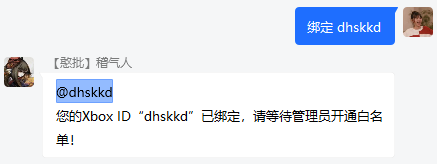
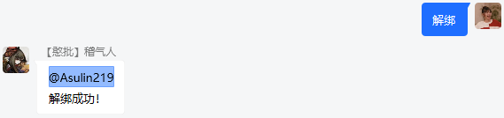
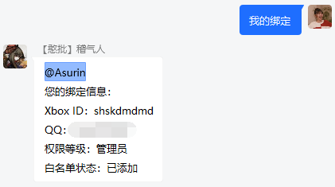
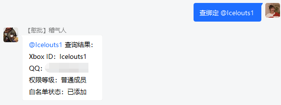

# XBridgeN：配置
## 全局配置
全局配置文件为`/config/global_setting.json` ，用于保存QQ登录、WebSocket连接等相关配置信息。以下是配置示例（正式配置时，请不要在文件内写注释）：
```json
{
	"qq": 123456,   //机器人QQ账号
	"login_qrcode": true,  //是否使用扫码登录，默认为true。如使用密码登录，请改为false
	"qq_password": "qqpassword",  //机器人QQ密码。仅在"login_qrcode"为false（使用密码登录）时，该项配置才有效
	"ws_address": "ws://127.0.0.1:8080",    //Websocket服务端地址
	"ws_password": "wspassword",    //WebSocket通信密钥，请与WebSocket服务端通信密钥保持一致
	"qq_group": [
		"123456"   //QQ群号，目前暂时只支持一个QQ群
	],
	"server_name": "生存服务器",  //服务器名称，目前暂时只支持一个服务器
}
```


## 正则表达式
正则表达式配置文件为`/config/regex.json`，用于保存群消息自动应答规则。当玩家在群内发送消息时，如果发送的文本和正则表达式中的关键词匹配，且玩家权限与该段关键词的所需权限匹配，即可触发相应的功能。配置示例如下：
```json
[
	{
        "keywords":"^绑定 ([A-Za-z0-9 ]{4,20})$",	//正则表达式，用于匹配群消息中的关键词
        "permission":0,		//执行动作所需权限，0为普通成员，1为管理员
        "actions":[		//关键词匹配时执行的动作，支持一个或多个
            {
                "type":"bind_whitelist",	//动作类型，见说明
                "content":"白名单申请已发送，请等待管理员审核！"	//动作内容，见说明
            }
        ]
    }
]
```

XBridgeN默认包含了默认的正则表达式配置。用户也可以对正则内容进行修改，满足各种使用需求。以下是正则表达式的配置示例以及实现的效果：

### 自助绑定白名单

keywords（关键词）|permission（权限）|type（动作类型）|content（内容）|
--|--|--|--
^绑定 ([A-Za-z0-9 ]{4,20})$|0|bind_whitelist|白名单申请已发送，请等待管理员审核！



### 自助解绑白名单

keywords（关键词）|permission（权限）|type（动作类型）|content（内容）|
--|--|--|--
^解绑$|0|unbind_whitelist|解绑成功|



### 查询本人绑定状态

keywords（关键词）|permission（权限）|type（动作类型）|content（内容）|
--|--|--|--
^关于我$|0|bind_check_self|我的信息：|




### 为目标玩家添加白名单

keywords（关键词）|permission（权限）|type（动作类型）|content（内容）|
--|--|--|--
^加白名单 (.+$)|1|add_whitelist|已将该玩家添加到所有服务器的白名单!|


### 删除目标玩家的白名单

keywords（关键词）|permission（权限）|type（动作类型）|content（内容）|
--|--|--|--
^删白名单 (.+$)|1|del_whitelist|已将该玩家从所有服务器的白名单中移除!|


### 查询目标玩家的绑定状态

keywords（关键词）|permission（权限）|type（动作类型）|content（内容）|
--|--|--|--
^查绑定 (.+$)|1|bind_check|查询结果：|



### 执行服务器控制台指令（以“查服”为例）

keywords（关键词）|permission（权限）|type（动作类型）|content（内容）|
--|--|--|--
^查服$|1|runcmd|list|


### 发起异步http GET请求（以“百度”为例）

keywords（关键词）|permission（权限）|type（动作类型）|content（内容）|
--|--|--|--
^百度$|0|http_get|http://www.baidu.com|


### 自动应答群消息（以“帮助”为例）

keywords（关键词）|permission（权限）|type（动作类型）|content（内容）|
--|--|--|--
^帮助$|0|group_message|[Tokiame Bot 帮助信息]......|


## 实体数据
实体命名配置文件为`./config/mobs.json`，用于保存实体（玩家、生物）命名。当玩家/生物被杀时，会通过该文件的内容将死亡事件转发到群内。以下是配置示例（文件过长，以下只展示一部分）：
```json
{
	"Arrow": "箭",
	"Bat": "蝙蝠",
	"Creeper": "爬行者",
	"Blaze": "烈焰人"
}
```
效果：


## 玩家配置
玩家配置文件为`./config/players_info.json`，用于保存玩家的各项信息。一般情况下无需改动。如果需要将玩家设置为机器人管理员，只需将"permission"项的值修改为1即可。以下是配置示例：
```json
[
	{
		"name": "Asurin",		//玩家昵称（Xbox ID）
		"qqid": 824907403,		//玩家QQ账号
		"permission": 0,		//玩家权限，默认为0。0为普通成员，1为管理员
		"enable": false			//绑定状态，false为已绑定、未添加白名单，true为已绑定、已添加白名单
	}
]
```