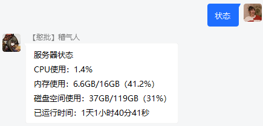

# XBridgeN：高级配置
## 正则表达式
正则表达式是XBridgeN的核心功能。XBridgeN包含了默认的正则表达式配置，涵盖了大部分的功能。用户可以根据实际需要，对正则内容进行修改，满足各种使用场景的需求。

文件位置|说明
--|--
`/config/regex.json`|配置群消息自动应答规则。
</br>

* 正则表达式还支持以下占位符（部分正则可用）：

占位符|说明
---|---
{player}|已绑定玩家的Xbox ID
{cpu_usage}|CPU使用率
{mem_usage}|内存使用率
{disk_usage}|磁盘空间使用率
{sys_uptime}|系统已运行时间

</br>

一个正则表达式配置文件的基本结构包括 **regex（正则体）**、**permission（所需执行权限）**、**actions（动作组）**。而**actions**内可以包含一个或多个动作，每个动作的基本结构为**type（动作类型）**和**content（动作内容）**。当玩家在群内发送消息时，如果发送的文本和正则表达式中配置中的关键词匹配，且玩家权限与该段关键词的所需权限匹配，即可触发相应的动作组。动作可以是执行指令，也可以是群内发送消息。下面将会针对默认的正则表达式配置进行详细介绍。

---
### 执行预定指令（以“查服”为例）

```json
{
	"regex": "^查服$",
	"permission": 0,
	"actions": [
		{
			"type": "runcmd",
			"content": "list"	//指令内容
		}
	]
}
```


* 预定指令目前还支持玩家占位符，用于实现一些特定功能，例如：
```json
{
	"regex": "^自杀$",
	"permission": 0,
	"actions": [
		{
			"type": "runcmd",
			"content": "kill {player}"
		}
	]
}
```


---
### 开服（仅支持Nillauncher）

```json
{
	"regex": "^开服$",
	"permission": 0,
	"actions": [
		{
			"type": "server_start_nl",		//仅Nillauncher可用
			"content": ""
		}
	]
}
```


---
### 执行自定义指令（以“whitelist reload”为例）

```json
{
	"regex": "^/cmd (.+$)",
	"permission": 1,
	"actions": [
		{
			"type": "runcmd_raw",
			"content": "指令发送成功！"
		}
	]
}
```


---
### 云黑自助查询

```json
{
	"regex": "^查云黑 (xboxid|qq) (.+)$",	//正则中的(xboxid|qq)部分为查询类型，切勿修改其内容和位置
	"permission": 0,
	"actions": [
		{
			"type": "blackbe_check",
			"content": "[云黑查询结果]"
		}
	]
}
```


**Tips**：云黑自主查询目前支持查询Xbox ID和QQ，只需在查询时在查询目标前附上查询类型（xboxid或qq）即可。

---

### 查询服务器状态

```json
{
	"regex": "^状态$",
	"permission": 0,
	"actions": [
		{
			"type": "sys_info",
			"content": "服务器状态\nCPU使用：{cpu_usage}\n内存使用：{mem_usage}\n磁盘空间使用：{disk_usage}\n已运行时间：{sys_uptime}"
		}
	]
}
```



**Tips**：这里查询的是XBridgeN所在服务器的状态。为了令查询结果更具参考价值，建议将XBridgeN与BDS部署在同一台主机上。

---
### 自助绑定白名单

```json
{
	"regex": "^绑定 ([A-Za-z0-9 ]{4,20})$",		//正则体
	"permission": 0,		//所需执行权限
	"actions": [	//动作组
		{
			"type": "bind_whitelist",	//动作模式
			"content": "您的Xbox ID“{player}”已绑定，请等待管理员开通白名单！"
			/* ↑ 动作内容，一般为动作执行后的群消息提示*/
		}
	]
}
```


---

### 自助添加白名单
```json
{
	"regex": "^我要白名单$",
	"permission": 0,
	"actions": [
		{
			"type": "add_whitelist_self",
			"content": "您的Xbox ID“{player}”已添加到服务器白名单！"
		}
	]
}
```


需要注意的是，玩家需要先绑定Xbox ID，然后才能使用自助添加白名单。

---
### 自助解绑白名单

```json
{
	"regex": "^解绑$",
	"permission": 0,
	"actions": [
		{
			"type": "unbind_whitelist",
			"content": "解绑成功！"
		}
	]
}
```


---
### 查询本人绑定状态

```json
{
	"regex": "^我的绑定$",
	"permission": 0,
	"actions": [
		{
			"type": "bind_check_self",
			"content": "您的绑定信息："
		}
	]
}
```


---
### 为目标玩家添加白名单

```json
{
	"regex": "^加白名单 (.+$)",
	"permission": 1,
	"actions": [
		{
			"type": "add_whitelist",
			"content": "已将“{player}”添加到所有服务器的白名单!"
		}
	]
}
```


---
### 删除目标玩家的白名单

```json
{
	"regex": "^删白名单 (.+$)",
	"permission": 1,
	"actions": [
		{
			"type": "del_whitelist",
			"content": "已将“{player}”从所有服务器的白名单中移除!"
		}
	]
}
```


---
### 查询目标玩家的绑定状态

```json
{
	"regex": "^查绑定 (.+$)",
	"permission": 0,
	"actions": [
		{
			"type": "bind_check",
			"content": "查询结果："
		}
	]
}
```


---
### 发起异步http/https GET请求（以“百度”为例）

```json
{
	"regex": "^百度$",
	"permission": 0,
	"actions": [
		{
			"type": "http_get",
			"content": "https://www.baidu.com",	//请求地址
			"succeed": "百度一下，你就知道",	//请求成功时发送的群消息内容
			"failed": "请求失败,请检查网路"		//请求失败时发送的群消息内容
		}
	]
}
```


**Tips**：该项功能适用于对接MCSM等服务器面板，控制BDS的开启/关闭。

---
### 群消息（以“帮助”为例）

```json
{
	"regex": "^帮助$",
	"permission": 0,
	"actions": [
		{
			"type": "group_message",
			"content": "这是一条没用的帮助信息"
		}
	]
}
```


---