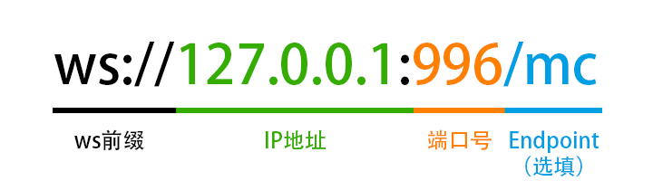

# 开始使用XBridgeN
## 开始之前
* 确保使用的是主流的操作系统平台（包括但不限于Windows、Linux、MacOS）；
* 确保操作系统已安装Node.js环境（Node.js版本要求为14.x及以上）；
* 确保BDS端已部署好**WebSocket服务器组件（LLWebSocket、XWebSocket或KWO）**。相关组件可前往 [XBridgeX交流群](https://jq.qq.com/?_wv=1027&k=rmCKLG7M) 获取。

## 初始配置与使用
1. 安装 [Node.js](https://nodejs.org/)（要求Node.js版本为14.x及以上）；
2. 下载 [XBridgeN](https://gitee.com/xbridgex/XBridge-Nodejs/releases)；
3. 解压，然后进入XBridgeN目录，运行`run.bat`（Windows用户）或`run.sh`（Linux用户）,启动XBridgeN（如果启动时提示缺少依赖模块，请删除`node_modules`文件夹，在终端输入 `npm i` 重新安装依赖模块）。初次启动后会在``./config``目录下生成默认的全局配置，并自动退出；
4. 打开全局配置文件`/config/global_setting.json` ，根据实际情况进行修改：
```json
{
	"qq": 123456,   //机器人QQ账号
	"login_qrcode": true,  //是否使用扫码登录，默认为true。如使用密码登录，请改为false
	"use_protocol": 2,	//设置QQ登录协议。1:安卓手机 2:安卓平板 3:安卓手表 4:MacOS 5:iPad
	"qq_password": "qqpassword",  //机器人QQ密码。仅在"login_qrcode"为false（使用密码登录）时，该项配置才有效
	"ws_address": "ws://127.0.0.1:8080",    //WebSocket服务器地址
	"ws_password": "wspassword",    //WebSocket服务器通信密钥
	"qq_group": [
		"123456"   //QQ群号，目前暂时只支持一个QQ群
	],
	"server_name": "生存服务器",  //服务器名称，目前暂时只支持一个服务器
}
```

WebSocket服务器地址请参照以下格式进行填写：

5. 全局配置修改完成并保存后，再次启动XBridgeN；
6. 启动BDS。当XBridgeN控制台出现类似以下的提示时，说明XBridgeN配置无误且运行正常：
```
WS服务器连接成功！
[2021-10-21T15:54:18.496] [MARK] [iPad:123456] - 正在探索可用服务器...
[2021-10-21T15:54:18.551] [MARK] [iPad:123456] - connecting to 109.244.168.25:8080
[2021-10-21T15:54:18.595] [MARK] [iPad:123456] - 109.244.168.25:8080 connected
[2021-10-21T15:54:18.973] [MARK] [iPad:123456] - Welcome, abc ! 初始化资源...
[2021-10-21T15:54:19.205] [MARK] [iPad:123456] - 加载了1个好友，1个群，1个陌生人。
[2021-10-21T15:54:19.349] [MARK] [iPad:123456] - 初始化完毕，开始处理消息。
```