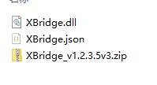
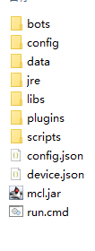

# 
XBridgeR

安装

***

## 装载

⚠️ 装载XBridgeR之前，请确保您装载了LLwebsoket，若未装载请您移步[装载LLWS](../../LLWS/install.md)

1.下载XBridge

可以在[minebbs](https://www.minebbs.com/resources/xbridge.2761/)或者[XBX官方QQ群](https://jq.qq.com/?_wv=1027&k=rmCKLG7M)中下载文件

下载后解压，如图所示

注：编写此页面时最新版本为1.2.3.5v3，实际装载时版本可能会随时间推移而改变

2.下载Mirai

可以在[XBX官方QQ群](https://jq.qq.com/?_wv=1027&k=rmCKLG7M)中下载文件

下载后解压，如图所示

把步骤一解压出来的dll和json放进`data/MiraiNative/plugins`中

注：如果找不到文件夹请先登陆一次

然后就是更改配置文件了，详见[文件](./files.md)页面